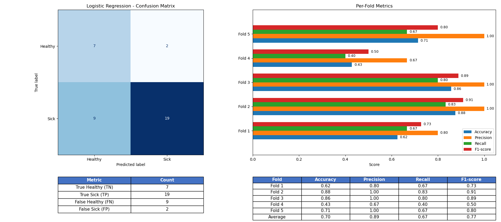
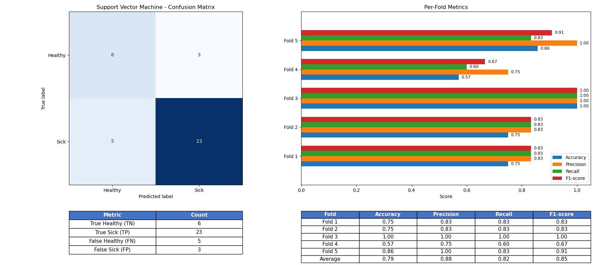
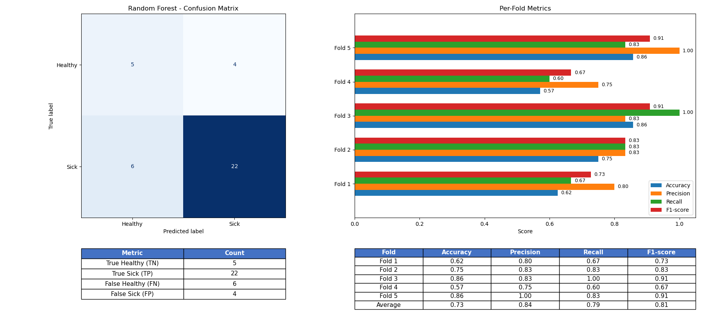

# Introduction

The recruitment task was to prepare a solution for the classification problem of detecting hypertrophic cardiomyopathy (cardiomegaly) based on the provided features. After a brief research, I decided to select the three machine learning models I considered best suited for the task: Logistic Regression, Support Vector Machine, and Random Forest. I evaluated each model separately and then compared their performance to identify the best one. The results and explanations are provided in this file.

---

# Model Evaluation 

## 1. Logistic Regression
The Logistic Regression model reached an average accuracy of **0.70**, with a precision of **0.893**, recall of **0.673**, and an F1-score of **0.765**.

Overall, the model did a decent job distinguishing between healthy and sick patients, but it missed a few cardiomegaly cases. In the confusion matrix, there were 19 true positives and 9 false negatives, showing that false negatives were still a problem.

**My interpretation:**  
Logistic Regression is a simple, linear model, so it doesn’t always capture the complex patterns. The high precision but lower recall means it was pretty conservative. It didn’t label someone as “sick” unless it was fairly sure. That reduced false positives, but unfortunately, it also meant missing some real cases.

---

## 2. Support Vector Machine (SVM)
The SVM model performed the best out of the three. It achieved an average accuracy of **0.786**, precision of **0.883**, recall of **0.820**, and an F1-score of **0.848**.

It stayed consistent across folds and even achieved a perfect score in one of them. SVM caught most of the cardiomegaly cases while keeping false positives low.

**My interpretation:**  
SVMs are good for small datasets, especially when the data isn’t perfectly separable by a straight line. That seems to have helped here. The model handled the complexity much better than Logistic Regression. The only thing that may be taken under consideration is a fold with perfected scores. It can be a sign of slight overfitting.

---

## 3. Random Forest
The Random Forest model got an average accuracy of **0.732**, with a precision of **0.843**, recall of **0.787**, and an F1-score of **0.809**.

It didn’t outperform SVM, but it still did better than Logistic Regression and maintained a decent balance between precision and recall.

**My interpretation:**  
Random Forests are usually solid on small datasets and can handle non-linear relationships. With only 37 patients, the model didn’t have enough data variety to show its potential. Overall, it performed pretty well.

---

# Model Comparison

| Model | Accuracy | Precision | Recall | F1-score |
|--------|-----------|------------|----------|-----------|
| Logistic Regression | 0.700 | **0.893** | 0.673 | 0.765 |
| Support Vector Machine | **0.786** | 0.883 | **0.820** | **0.848** |
| Random Forest | 0.732 | 0.843 | 0.787 | 0.809 |

**Ranking:**
1. **SVM** – best overall and most balanced results.  
2. **Random Forest** – good balance between recall and precision.  
3. **Logistic Regression** – good baseline, but too simple for this kind of data.

---

## Possible Reasons for These Results

- **Small Dataset (37 patients):** With such a limited sample, adding even one unusual case could change the results.
- **Class Imbalance:** If one class had more patients than the other, the models might have leaned toward predicting that class more often. That could explain the gaps between precision and recall.  
- **Feature Complexity:** Logistic Regression assumes everything’s linear, which rarely happens with medical data.
- **Cross-Validation Variance:** Because the dataset was so small, results varied noticeably between folds.

---

## Conclusion
Overall, **SVM** outperformed the other methods. It did a good job detecting patients with cardiomegaly without creating too many false positives. Keeping in mind that we only have 37 patients in the dataset, these results shouldn’t be considered final. A larger dataset would give a much clearer results of how well these models actually perform in real-world clinical use.
